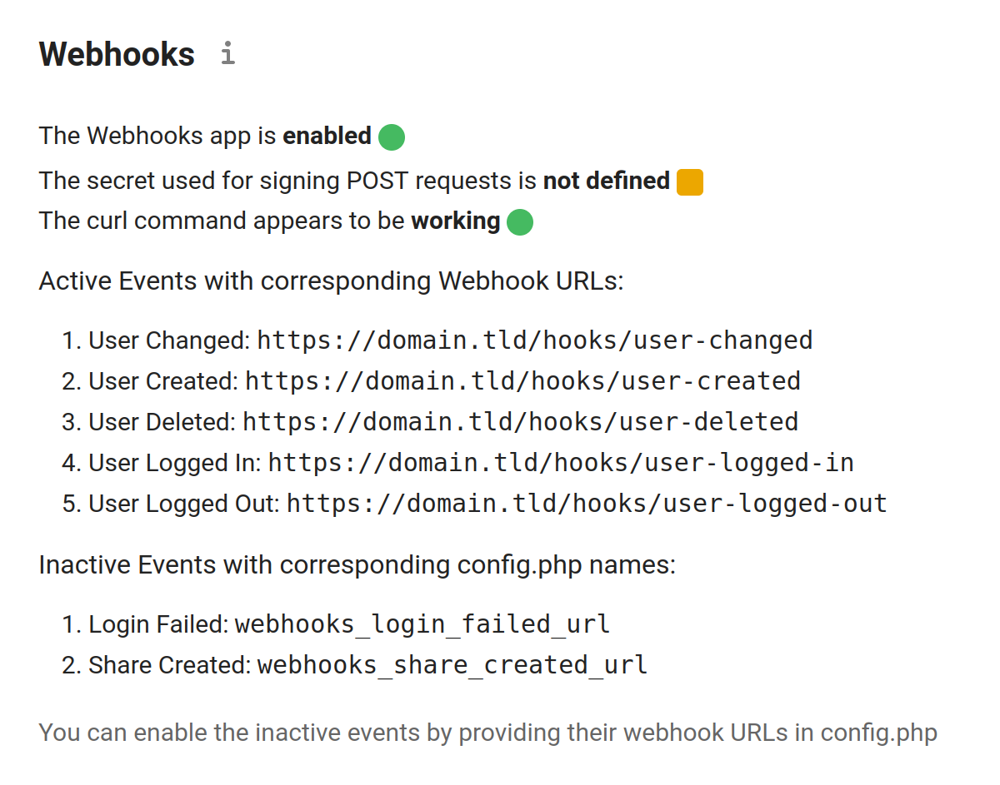
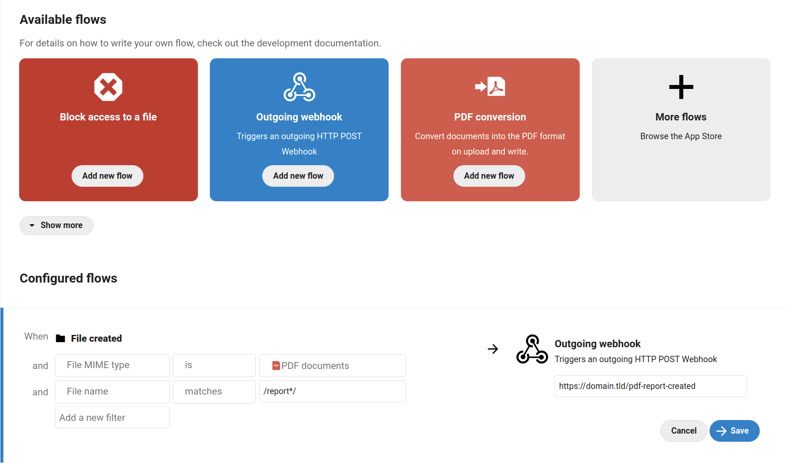

#  Webhooks for Nextcloud 

This app allows a Nextcloud instance to notify external systems via HTTP POST requests whenever an event of a given type occurs.

Features:
- Sending webhook notifications to URLs specified on per-event type basis (11 event types supported as of the current version)
- Authenticating outgoing POST requests with SHA256 signatures
- Sending webhook notifications as a Flow action
- Outgoing requests are sent in a fire-and-forget (`exec(curl &)`) manner in order not to block the thread execution

## Requirements

-   Nextcloud version 20-24
-   Ability to `exec(curl)` from a PHP script

## Usage

This app is published in the [Nextcloud App Store](https://apps.nextcloud.com/apps/webhooks). Alternatively, it can be installed manually by grabbing the release `.tar.gz` archive, unpacking it in the `apps` folder of your Nextcloud instance and activating the app in the Admin UI.

When active, the App status is reported in Settings > Administration > Security > (scroll down to) Webhooks.



### Event-based outgoing Webhooks

In order to enable webhooks for a given event type, you have to provide the target URL with the config key corresponding the a given event in your [config file](https://docs.nextcloud.com/server/latest/admin_manual/configuration_server/config_sample_php_parameters.html). Example (User Logged In Event):

```PHP
  'webhooks_user_logged_in_url' => 'https://your-service.tld/hooks/user-logged-in',
```

### Flow-based outgoing Webhooks

Aside from listening for specific events, this app also supports sending HTTP POST notifications triggered by a Flow defined by the admin with a specified endpoint URL.



With the example Flow listed above being active, when a new a new PDF file is uploaded, name of which matches __report__, a POST request is sent to the specified URL with the following payload:

```javascript
{
  eventType: 'OCA\\WorkflowEngine\\Entity\\File',
  eventName: '\\OCP\\Files::postCreate',
  node: {
    id: 354,
    storage: {
      mountPoint: '/admin/',
      cache: null,
      scanner: {},
      watcher: null,
      propagator: null,
      updater: {}
    },
    path: '/admin/files/report-1234.pdf',
    internalPath: 'files/report-1234.pdf',
    modifiedTime: 1631793637,
    size: 1642,
    Etag: '6a8a183a68f22455d7a561d8e3d1f6b9',
    mimeType: 'application/pdf',
    permissions: 27,
    isUpdateable: true,
    isDeletable: true,
    isShareable: true
  },
  workflowFile: {
    displayText: 'admin created report-1234.pdf',
    url: 'http://localhost:8080/index.php/f/354'
  }
}
```

Example notification payloads for other Flow event types are listed [here](#flow-events).

## Authenticating requests

If the Nextcloud instance and the service responsible for receiving incoming webhook notifications are to communicate over public internet, it is important to provide a secret key used for signing the notifications in order to protect the receiving service from spoofing attacks. This app allows you to define `webhooks_secret` in your Nextcloud `config.php` like so:

```PHP
  'webhooks_secret' => 'yoursecret1234',
```

Once the secret is defined, all outgoing webhook notifications will contain a signature in the `X-Nextcloud-Webhooks` HTTP header. The signature is calculated by performing a SHA256 function on the POST request raw body concatenated with the secret defined earlier.

Below is a minimal example of a Node.js Express app (with `body-parser`) validating incoming webhook notification signature:

```javascript
const express = require("express");
const app = express();
const bodyParser = require('body-parser');
const crypto = require('crypto');

app.use(bodyParser.json({
  verify: function(req, res, buf, encoding) {
        req.rawBody = buf.toString();
    }
}))

app.post('/login-failed', (req, res) => {
  var hash = crypto.createHash('sha256');
  hash.update(req.rawBody + "yoursecret1234");
  var expected = hash.digest('hex');
  var obtained = req.get('X-Nextcloud-Webhooks');

  console.log("expected: ", expected);
  console.log("obtained: ", obtained);

  if (expected === obtained) {
    // request signature is VALID
    console.log(req.body);
  } else {
    // request signature is INVALID
  }

  res.status(200);
})

app.listen(3000, () => { console.log("Server started.") })

```

## Available events

### Calendar Object Created

Fires whenever a calendar event is created.

Config name: `webhooks_calendar_object_created_url`

Notification payload:
```javascript
{
  calendarId: 2,
  calendarData: {
    id: '2',
    uri: 'personal',
    principaluri: 'principals/users/admin',
    // [...]
    '{http://apple.com/ns/ical/}calendar-order': '0',
    '{http://apple.com/ns/ical/}calendar-color': '#795AAB',
    '{http://nextcloud.com/ns}deleted-at': null,
    '{http://nextcloud.com/ns}owner-displayname': 'admin'
  },
  shares: [],
  objectData: {
    id: '1',
    uri: '399C189E-CCA6-4F67-AC67-35A9B53B51EB.ics',
    lastmodified: '1633198361',
    etag: '"58731caeaf6c998ca2dbcf5d83af756a"',
    calendarid: '2',
    size: 901,
    calendardata: 'BEGIN:VCALENDAR\r\n' +
      'VERSION:2.0\r\n' +
      'CALSCALE:GREGORIAN\r\n' +
      'PRODID:-//IDN nextcloud.com//Calendar app 2.2.2//EN\r\n' +
      'BEGIN:VTIMEZONE\r\n' +
      // [...] more data in iCal format
      'END:VEVENT\r\n' +
      'END:VCALENDAR\r\n',
    component: 'vevent',
    classification: 0
  },
  eventType: 'OCA\\DAV\\Events\\CalendarObjectCreatedEvent'
}
```

### Calendar Object Updated

Fires whenever a calendar event is edited (including meeting participant accepting/declining invitations).

Config name: `webhooks_calendar_object_updated_url`

Notification payload:
```javascript
{
  calendarId: 2,
  calendarData: {
    id: '2',
    uri: 'personal',
    principaluri: 'principals/users/admin',
    // [...]
    '{http://apple.com/ns/ical/}calendar-order': '0',
    '{http://apple.com/ns/ical/}calendar-color': '#795AAB',
    '{http://nextcloud.com/ns}deleted-at': null,
    '{http://nextcloud.com/ns}owner-displayname': 'admin'
  },
  shares: [],
  objectData: {
    id: '1',
    uri: '399C189E-CCA6-4F67-AC67-35A9B53B51EB.ics',
    lastmodified: '1633198361',
    etag: '"58731caeaf6c998ca2dbcf5d83af756a"',
    calendarid: '2',
    size: 901,
    calendardata: 'BEGIN:VCALENDAR\r\n' +
      'VERSION:2.0\r\n' +
      'CALSCALE:GREGORIAN\r\n' +
      'PRODID:-//IDN nextcloud.com//Calendar app 2.2.2//EN\r\n' +
      'BEGIN:VTIMEZONE\r\n' +
      // [...] more data in iCal format
      'END:VEVENT\r\n' +
      'END:VCALENDAR\r\n',
    component: 'vevent',
    classification: 0
  },
  eventType: 'OCA\\DAV\\Events\\CalendarObjectUpdatedEvent'
}
```

### Login Failed

Fires whenever a login attempt with an existing username fails.

Config name: `webhooks_login_failed_url`

Notification payload:
```javascript
{
  userId: 'admin',
  eventType: 'OCP\\Authentication\\Events\\LoginFailedEvent'
}
```

### Password Updated

Fires whenever user's password is changed.

Config name: `webhooks_password_updated_url`

Notification payload:
```javascript
{
  user: {
    id: 'jdoe',
    displayName: 'John Doe',
    lastLogin: 0,
    home: '/home/nextcloud/data/jdoe',
    emailAddress: 'jdoe@example.com',
    cloudId: 'jdoe@yourcloud.tld',
    quota: '5 GB'
  },
  eventType: 'OCP\\User\\Events\\PasswordUpdatedEvent'
}
```

### Share Created

Fires whenever a new share is created.

Config name: `webhooks_share_created_url`

Notification payload:
```javascript
{
  id: '1',
  fullId: 'ocinternal:1',
  nodeId: 7,
  nodeType: 'file',
  shareType: 3,
  sharedWith: null,
  sharedWithDisplayName: null,
  sharedWithAvatar: null,
  permissions: 17,
  status: 0,
  note: '',
  expirationDate: null,
  label: '',
  sharedBy: 'admin',
  shareOwner: 'admin',
  token: '7qSPknbEjeHAzgJ',
  target: '/welcome.txt',
  shareTime: {
    date: '2021-06-20 14:23:18.000000',
    timeinzone_type: 3,
    timezone: 'UTC'
  },
  mailSend: true,
  hideDownload: false,
  eventType: 'OCP\\Share\\Events\\ShareCreatedEvent'
}
```

### User Changed

Fires whenever a user account is edited. Includes values before and after edit.

Config name: `webhooks_user_changed_url`

Notification payload:
```javascript
{
  user: {
    id: 'jdoe',
    displayName: 'John Doe',
    lastLogin: 0,
    home: '/home/nextcloud/data/jdoe',
    emailAddress: 'jdoe@example.com',
    cloudId: 'jdoe@yourcloud.tld',
    quota: '5 GB'
  },
  feature: 'quota',
  value: '5 GB',
  oldValue: 'default',
  eventType: 'OCP\\User\\Events\\UserChangedEvent'
}

```

### User Created

Fires whenever a new user is created.

Config name: `webhooks_user_created_url`

Notification payload:
```javascript
{
  user: {
    id: 'admin',
    displayName: 'Jane Doe',
    lastLogin: 1624203500,
    home: '/home/nextcloud/data/admin',
    emailAddress: null,
    cloudId: 'admin@yourcloud.tld',
    quota: 'none'
  },
  loginName: 'admin',
  isTokenLogin: false,
  eventType: 'OCP\\User\\Events\\UserLoggedInEvent'
}
```

### User Deleted

Fires whenever a user account is deleted.

Config name: `webhooks_user_deleted_url`

Notification payload:
```javascript
{
  user: {
    id: 'jdoe',
    displayName: 'John Doe',
    lastLogin: 0,
    home: '/home/nextcloud/data/jdoe',
    emailAddress: null,
    cloudId: 'jdoe@yourcloud.tld',
    quota: 'none'
  },
  eventType: 'OCP\\User\\Events\\UserDeletedEvent'
}
```

### User Live Status Updated

Fires whenever user's live status is updated to __online__ (happens when user navigates between apps and doesn't necessarily indicate that the status changed).

Config name: `webhooks_user_status_url`

```javascript
{
  user: {
    id: 'admin',
    displayName: 'Jane Doe',
    lastLogin: 1631198561,
    home: '/home/nextcloud/data/admin',
    emailAddress: null,
    cloudId: 'admin@yourcloud.tld',
    quota: 'none'
  },
  status: 'online',
  timestamp: 1633198561,
  eventType: 'OCP\\User\\Events\\UserLiveStatusEvent'
}
```

### User Logged In

Fires whenever a user logs in successfully.

Config name: `webhooks_user_logged_in_url`

Notification payload:
```javascript
{
  user: {
    id: 'admin',
    displayName: 'Jane Doe',
    lastLogin: 1624203500,
    home: '/home/nextcloud/data/admin',
    emailAddress: null,
    cloudId: 'admin@yourcloud.tld',
    quota: 'none'
  },
  loginName: 'admin',
  isTokenLogin: false,
  eventType: 'OCP\\User\\Events\\UserLoggedInEvent'
}
```

### User Logged Out

Fires whenever a user logs out successfully.

Config name: `webhooks_user_logged_out_url`

Notification payload:
```javascript
{
  user: {
    id: 'admin',
    displayName: 'Jane Doe',
    lastLogin: '1624203500',
    home: '/home/nextcloud/data/admin',
    emailAddress: null,
    cloudId: 'admin@yourcloud.tld',
    quota: 'none'
  },
  eventType: 'OCP\\User\\Events\\UserLoggedOutEvent'
}
```

## Flow events

### File created

```javascript
{
  eventType: 'OCA\\WorkflowEngine\\Entity\\File',
  eventName: '\\OCP\\Files::postCreate',
  node: {
    id: 75,
    storage: {
      mountPoint: '/admin/',
      cache: null,
      scanner: {},
      watcher: null,
      propagator: null,
      updater: {}
    },
    path: '/admin/files/test2.pdf',
    internalPath: 'files/test2.pdf',
    modifiedTime: 1633196032,
    size: 1642,
    Etag: '97e0c8f490acb83e9b94f9c9e8eeb280',
    mimeType: 'application/pdf',
    permissions: 27,
    isUpdateable: true,
    isDeletable: true,
    isShareable: true
  },
  workflowFile: {
    displayText: 'admin created test2.pdf',
    url: 'http://localhost:8000/index.php/f/75'
  }
}
```

### File updated

```javascript
{
  eventType: 'OCA\\WorkflowEngine\\Entity\\File',
  eventName: '\\OCP\\Files::postWrite',
  node: {
    id: 128,
    storage: {
      cache: null,
      scanner: {},
      watcher: null,
      propagator: null,
      updater: {}
    },
    path: '/admin/files/test-file.txt',
    internalPath: 'files/test-file.txt',
    modifiedTime: 1647687121,
    size: 9,
    Etag: '914a2364bc8786dcb2a3b74889f692f5',
    mimeType: 'text/plain',
    permissions: 27,
    isUpdateable: true,
    isDeletable: true,
    isShareable: true
  },
  workflowFile: {
    displayText: 'admin modified test-file.txt',
    url: 'http://localhost:8000/index.php/f/128'
  }
}
```

### File renamed

```javascript
{
  eventType: 'OCA\\WorkflowEngine\\Entity\\File',
  eventName: '\\OCP\\Files::postRename',
  node: {
    id: 75,
    storage: {
      mountPoint: '/admin/',
      cache: null,
      scanner: {},
      watcher: null,
      propagator: null,
      updater: {}
    },
    path: '/admin/files/test2.pdf',
    internalPath: 'files/test2.pdf',
    modifiedTime: 1633196032,
    size: 1642,
    Etag: '97e0c8f490acb83e9b94f9c9e8eeb280',
    mimeType: 'application/pdf',
    permissions: 27,
    isUpdateable: true,
    isDeletable: true,
    isShareable: true
  },
  workflowFile: {
    displayText: 'admin renamed test2.pdf',
    url: 'http://localhost:8000/index.php/f/75'
  }
}
```

### File copied

```javascript
{
  eventType: 'OCA\\WorkflowEngine\\Entity\\File',
  eventName: '\\OCP\\Files::postCopy',
  node: {
    id: 80,
    storage: {
      mountPoint: '/admin/',
      cache: null,
      scanner: {},
      watcher: null,
      propagator: null,
      updater: {}
    },
    path: '/admin/files/test2 (copy).pdf',
    internalPath: 'files/test2 (copy).pdf',
    modifiedTime: 1647686658,
    size: 1642,
    Etag: '3ce44278e289299fa8e6a27f05b7f54e',
    mimeType: 'application/pdf',
    permissions: 27,
    isUpdateable: true,
    isDeletable: true,
    isShareable: true
  },
  workflowFile: {
    displayText: 'admin copied test2 (copy).pdf',
    url: 'http://localhost:8000/index.php/f/80'
  }
}
```

### File deleted

```javascript
{
  eventType: 'OCA\\WorkflowEngine\\Entity\\File',
  eventName: '\\OCP\\Files::postDelete',
  node: {
    id: 75,
    storage: {
      mountPoint: '/admin/',
      cache: null,
      scanner: {},
      watcher: null,
      propagator: null,
      updater: {}
    },
    path: '/admin/files/test2.pdf',
    internalPath: 'files/test2.pdf',
    modifiedTime: 1633196032,
    size: 1642,
    Etag: '97e0c8f490acb83e9b94f9c9e8eeb280',
    mimeType: 'application/pdf',
    permissions: 27,
    isUpdateable: true,
    isDeletable: true,
    isShareable: true
  },
  workflowFile: {
    displayText: 'admin deleted test2.pdf',
    url: 'http://localhost:8000/index.php/f/75'
  }
}
```

### Tag assigned

```javascript
{
  eventType: 'OCA\\WorkflowEngine\\Entity\\File',
  eventName: 'OCP\\SystemTag\\ISystemTagObjectMapper::assignTags',
  mapperEvent: {
    eventName: 'OCP\\SystemTag\\ISystemTagObjectMapper::assignTags',
    objectType: 'files',
    objectId: '75',
    tags: [ '1' ]
  },
  workflowFile: {
    displayText: 'admin assigned test-tag to test2.pdf',
    url: 'http://localhost:8000/index.php/f/75'
  }
}
```
